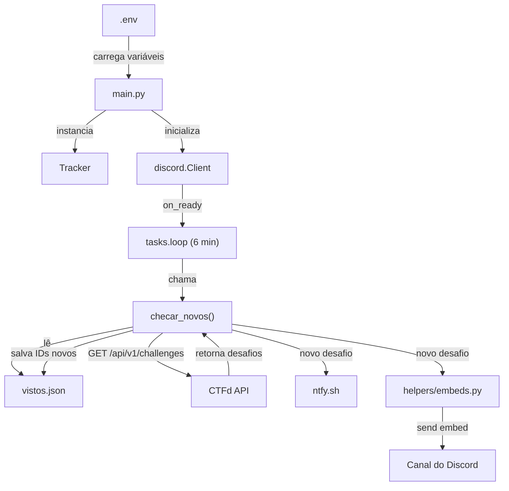

<h1 align="center">Bot CTFd</h1>
<p align="center">
  Monitora novos desafios de uma competição <a href="https://github.com/CTFd/CTFd">CTFd</a> e envia alertas no Discord
</p>
<p align="center">
  
  
  
  
</p>

Quando um novo desafio aparece na plataforma CTFd, o bot envia um embed no canal do Discord configurado e uma notificação push via ntfy.sh. Os desafios já alertados são persistidos localmente para evitar alertas duplicados entre reinicializações.

## Requisitos

- Python 3.11+
- Um bot do Discord com permissão de enviar mensagens no canal desejado
- Uma instância CTFd com API Key gerada em Account > Settings > API Keys

## Instalação

```bash
pip install discord.py requests python-dotenv
```

## Configuração

Crie um arquivo `.env` dentro de `src/`:

```env
token=seu_token_do_discord
channel_id=123456789012345678
URL_API_CHALLENGES=https://seu-ctfd.com/api/v1/challenges
API_KEY=ctfd_...
NTFY_TOPIC=seu_topico_aqui
```

## Como rodar

```bash
cd src
python3 main.py
```

## Estrutura

```
bot-ctfd/
├── src/
│   ├── main.py               # Entrypoint, inicializa bot e loop
│   ├── vistos.json           # IDs de desafios já alertados (gerado automaticamente)
│   ├── helpers/
│   │   └── embeds.py         # Envio de embeds no Discord
│   └── tracker/
│       └── tracker.py        # Polling da API do CTFd
└── .env
```

## Arquitetura


